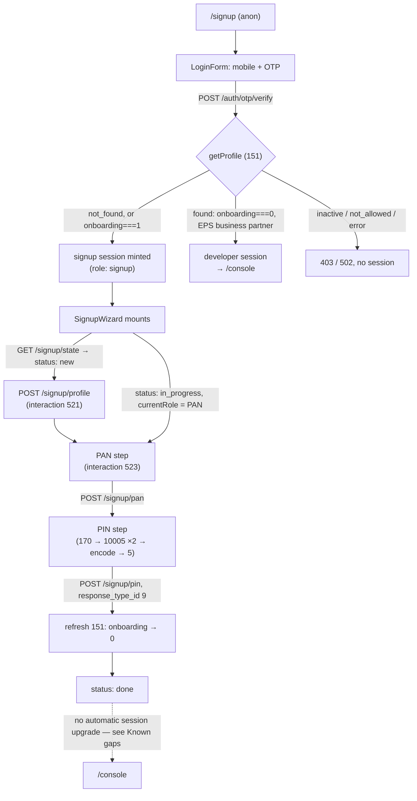

# User Onboarding (Self-Serve Signup)

`/signup` lets a new mobile number create an EPS account without going through
the Eloka webapp: OTP → partial account → PAN → PIN → `/console`. It replaces
the old `/signup` page, which was a Zoho lead-capture iframe
(`src/pages/SignupPage.tsx` is now the wizard host, not that iframe).

Design rationale: `docs/superpowers/specs/2026-07-15-user-onboarding-design.md`.
This document describes the code as built; where the two disagree, this
document wins and the disagreement is called out explicitly.

## Journey



Every step re-fetches the upstream profile (interaction 151) and returns
fresh `SignupState`; the client never infers its own progress. This is what
makes resume-after-drop-off and retry-after-failure the same code path
(`packages/eps-backend/src/signup/service.ts:114-117`, `refresh()`).

## Why there is no Eko access token

`/transactions/do` and `/transactions/upload`, which the Eloka webapp calls,
are **not Eko endpoints** — they are routes on Eloka's own BFF (`connect-api`),
which forwards to the same form-encoded SimpliBank path `eps-backend` already
calls. The `Bearer` token Eloka sends never goes upstream; `connect-api` uses
it only to derive `initiator_id` / `user_code` / `org_id` for the outbound
call, falling back to a configured default pair when they're absent (exactly
the signup case, before a real user identity exists).

`eps-backend` is the equivalent layer and does this today, in
`packages/eps-backend/src/clients/eko.ts:168-183`:

```ts
function base(orgId?: number): Record<string, string> {
	return {
		initiator_id: cfg.initiatorId,
		user_code: cfg.userCode,
		org_id: String(orgId ?? cfg.defaultOrgId),
	};
}

function actor(identity: EkoIdentity): Record<string, string> {
	return {
		initiator_id: identity.initiatorId,
		user_code: identity.userCode,
		org_id: String(identity.orgId),
	};
}
```

`base()` supplies the configured `EKO_INITIATOR_ID` / `EKO_USER_CODE` pair
(`packages/eps-backend/src/config.ts:100-101`) before a partial account
exists (used by `createPartialAccount`, interaction 521). `actor()` supplies
the user's own `ekoUserId` / `code`, mapped from the 151 response
(`eko.ts:391-392` in `mapProfile`), for every step after the account exists
(523, 170, 10005, 5).

Every upstream call authenticates with the `developer_key` header alone
(`eko.ts:120`, `post()`). No Eko access token is captured, stored, or
refreshed anywhere in this feature — the existing HttpOnly session cookie is
the only credential the browser holds.

## The `onboarding === 1` gate

`getProfile` in `packages/eps-backend/src/clients/eko.ts:234-290` classifies
the upstream 151 response into a `ProfileResult`. The onboarding check
(`eko.ts:262-275`) runs **before** the EPS-business-partner check
(`eko.ts:276-279`):

```ts
if (code === SUCCESS_CODE && d) {
	// Onboarding-in-progress is checked FIRST and deliberately: user_type
	// flips to "23" as soon as the partial account exists, so it cannot
	// tell an in-progress user from a finished one. `onboarding === 1` is
	// the only reliable signal. Gating on user_type first would classify
	// every mid-onboarding user as not_allowed and lock them out on every
	// subsequent login.
	if (Number(d.onboarding ?? 0) === 1) {
		return { kind: "onboarding", responseTypeId: code, profile: mapProfile(d) };
	}
	if (Number(d.org_id ?? 0) !== 1 || String(d.user_type ?? "") !== "23") {
		return { kind: "not_allowed", responseTypeId: code };
	}
	return { kind: "found", responseTypeId: code, profile: mapProfile(d) };
}
```

`user_type` becomes `"23"` the moment `createPartialAccount` (521) succeeds —
long before onboarding is actually complete. If the `user_type` check ran
first, every user who created a partial account but hasn't finished PAN/PIN
would fail the business-partner check on their next login and be classified
`not_allowed` (a hard 403), permanently locking them out of resuming. Checking
`onboarding === 1` first is the only ordering that lets a mid-onboarding user
keep resuming.

`ProfileResult` (`packages/eps-backend/src/types.ts:24-42`) carries this as
its own `onboarding` variant, distinct from `found`. A unit test in
`clients/eko.test.ts` (`"getProfile onboarding classification"`) asserts the
ordering directly: a profile with `user_type: "23"` **and** `onboarding: 1`
still returns `kind: "onboarding"`, not `found`.

The verify-OTP handler (`packages/eps-backend/src/http/app.ts:182-282`) acts
on this:

| `getProfile` result | Response |
|---|---|
| `not_found` | signup session (no steps done yet) |
| `onboarding` | signup session (resume — see below) |
| `found` | developer session (unchanged from before this feature) |
| `inactive` | 403 `ACCOUNT_INACTIVE` |
| `not_allowed` | 403 `NOT_ALLOWED` |
| `error` | 502 `PROFILE_UNAVAILABLE` |

The old `403 NOT_REGISTERED` branch (behind a `TODO(signup)`) is gone —
`not_found` and `onboarding` are combined into one branch at
`app.ts:238-257`. The error code no longer exists anywhere in the codebase.

## Session roles

`SessionClaim.role` (`packages/eps-backend/src/auth/session.ts:14`) gains a
third value:

```ts
role: "developer" | "admin" | "signup";
```

A `signup` session authorizes `/signup/*` only — `requireSignupSession` in
`packages/eps-backend/src/http/signup.ts:27-39` rejects any other role with
`403 NOT_SIGNUP_SESSION`, and `/admin/*` never accepts it. The claim carries
`sub` (the mobile) exactly like a developer session; cookies, TTLs, and
refresh rotation (`session.ts:99-124`) are unmodified.

`GET /me` (`app.ts:331-357`) special-cases this role **before** it would
otherwise call the Eko API:

```ts
if (claim.role === "signup") {
	const view: SignupView = { role: "signup", mobile: claim.sub };
	return c.json(view);
}
```

This mirrors how the pre-existing admin branch (`app.ts:337-343`) avoids an
Eko/Zoho call. `AuthProvider` boots exclusively from `/me`
(`src/lib/auth/AuthProvider.tsx:50-56`, `refresh()`), so if `/me` rejected or
special-cased away a signup session, reloading the page mid-onboarding would
drop the user to `anon` and force a brand-new OTP — defeating resume. Instead
`SignupView` is a fixed, two-field shape (`role`, `mobile`) with no upstream
call, so the reload is cheap and instant; the actual onboarding progress is
fetched separately by `SignupWizard` from `GET /signup/state`, which *does*
hit the Eko profile.

`AuthProvider.classify()` (`src/lib/auth/AuthProvider.tsx:34-44`) maps this
onto a typed `AuthState` variant, `{ status: "authed"; role: "signup"; me:
SignupView }`, which `SignupPage.tsx` switches on directly.

## Interaction reference table

All five onboarding interactions post to the same `cfg.eko` SimpliBank path
via the shared `post()` helper (`eko.ts:113-166`), form-urlencoded, with the
`developer_key` header. Success is judged per-interaction — there is no
single convention:

| # | Interaction | Method (`eko.ts`) | Identity used | Success condition |
|---|---|---|---|---|
| 521 | Create partial account | `createPartialAccount` (291-309) | configured default (`base()`) | `response_type_id === 1566` (`CREATE_PARTIAL_ACCOUNT_OK`) |
| 523 | Verify PAN | `verifyPan` (310-325) | user's own (`actor()`) | `response_type_id === 1569` (`PAN_VERIFICATION_OK`) |
| 170 | Get booklet number | `getBooklet` (326-351) | user's own | **both** `response_status_id === 0` **and** `response_type_id === 1646` (`BOOKLET_OK`) — the code comments that this interaction reports success on both ids and neither alone is accepted |
| 10005 | Fetch pintwin key | `fetchPintwinKey` (352-365) | user's own | no status code check — accepted iff the response carries both a non-empty `pintwin_key` and a `key_id` |
| 5 | Set secret PIN | `setSecretPin` (366-382) | user's own | `response_type_id === 9` (`SECRET_PIN_OK`) |

`stepResult()` (`eko.ts:185-195`) is the shared classifier for 521/523/5,
comparing `response_type_id` against the interaction's own success constant
and otherwise surfacing the upstream `message` as `EkoStepResult`.

523 sends only `doc_id` (the PAN) as a form field — no file, no multipart
body (`eko.ts:312-323`; confirmed by `clients/eko.test.ts`, `"verifyPan
sends 523 with the user's own identity and no file"`). The design's original
"no file part" question is settled: it is genuinely not sent.

## Pintwin (170 → 10005 → 5)

Pintwin is **digit substitution, not encryption**. The 10005 response hands
back a 10-character permutation of `0`-`9` in plaintext
(`packages/eps-backend/src/signup/pintwin.ts:1-41`):

```ts
export function encodePin(pin: string, key: string, keyId: number | string): string {
	// out[i] = key[pin[i]], then "encoded|keyId"
}
```

`out[i] = key[Number(pin[i])]`, joined and suffixed with `"|" + keyId`. Golden
vectors from Eloka's own tests, asserted in `signup/pintwin.test.ts`:
`encodePin("1234", "1974856302", 39) === "9748|39"` and
`encodePin("0123", "0123456789", 55) === "0123|55"`.

Because the key ships in the clear, obfuscation is the only property this
buys on its own. The real security property is that **each key is single-use
and invalidated upstream per attempt**, so a captured `okekey` cannot be
replayed. `signup/service.ts:145-186` (`submitPin`) fetches one fresh key per
PIN — two independent calls to `fetchPintwinKey`, mirroring Eloka's two
independent Pintwin mounts — so a failed attempt simply re-keys on retry;
there is no refresh-signalling logic anywhere.

Encoding runs entirely in the BFF (`signup/service.ts:176-177`, the two
`encodePin(...)` calls feeding `eko.setSecretPin`). The client
(`src/features/signup/PinStep.tsx`) sends the two raw 4-digit PINs over
HTTPS to `POST /signup/pin` and holds no key state at all — no fetch, no
hook, no loader tied to the pintwin lifecycle. `service.ts:146-153` validates
`pin1 === pin2` and the 4-digit format **before** touching upstream, so a
client-side mismatch never burns a single-use key.

## How to add a step

The step order and labels are never hardcoded on either side — they come
from the API's `onboarding_steps` at runtime. Adding a step is two additions,
no branching logic anywhere else:

**Backend** (`packages/eps-backend/src/`):
1. Add an interaction method to `clients/eko.ts` (follow the `verifyPan` /
   `setSecretPin` pattern: build the form fields, call `post()`, classify the
   result).
2. Add an orchestration method to `signup/service.ts` that calls it and
   returns `refresh(mobile, xRealIp)` so the client gets fresh state.
3. Add a route to `http/signup.ts` that validates input, calls the service
   method, and maps `SignupStepError` via `toAppError`.

**Frontend** (`src/features/signup/`):
1. Write the step component to the `StepProps` contract
   (`resolveSteps.ts:4-15`): `onSubmit(values: string[])`, `busy`, `error`.
2. Add **one** entry to `SIGNUP_STEPS` in `steps.ts`, with the role code and a
   `submit` closure:

```ts
{ role: 13000, name: "pan", label: "PAN Details", Component: PanStep,
  submit: (client, [pan]) => client.submitPan(pan) },
```

That is the entire registry surface. `resolveSteps()` (`resolveSteps.ts:82-111`)
filters the registry down to whatever roles the API actually returned, orders
them by the API's order (not the registry's), prefers the API's label,
falling back to the registry's, and marks steps before `currentRole`
complete. **The wizard never branches on step names** — `SignupWizard.tsx`
picks whichever `ResolvedStep` has `status === "current"` and renders its
`Component`, forwarding `onSubmit` straight into that step's own `submit`
closure (`SignupWizard.tsx:159-162`). A role in the API the registry doesn't
know is silently skipped rather than thrown on, so the backend can ship a new
step before the frontend has UI for it.

Note: the design spec described this differently — "add its submit shape to
the wizard's `onSubmit` switch." That switch does not exist in the built
code; the wizard has zero knowledge of step-specific call signatures. Each
`StepDefinition` owns its own `submit`, which is strictly less coupling than
the spec proposed, and is what's actually shipped.

## Known constants and their caveats

`ONBOARDING_LATLONG = "27.176670,78.008075,7787"`
(`packages/eps-backend/src/clients/eko.ts:61-67`) is sent on every
interaction that wants a `latlong` field (521, 523, 170, 5). This flow does
not port Eloka's geolocation capture step, and Eloka itself falls back to
this exact value when its own capture step is skipped or denied. **Not
confirmed against real UAT** — it may be silently accepted, or the field may
not be required at all for these interactions.

`alternate_user_id` on 10005 (`fetchPintwinKey`, `eko.ts:357`) is sent as the
user's mobile number. Eloka's own implementation reads a `temp_user_id` from
`sessionStorage` whose provenance is not visible in that codebase — this
design substitutes the mobile as a reasonable guess. **Not confirmed against
real UAT.** If 10005 ever returns no key, this is the first thing to check;
it is a one-line change (`eko.ts:357`).

## Log redaction

`packages/eps-backend/src/audit/ekoLog.ts:74-75` redacts three fields, at
every non-`off` log level:

```ts
const REDACTED_REQUEST_FIELDS = new Set(["first_okekey", "second_okekey"]);
const REDACTED_RESPONSE_FIELDS = new Set(["pintwin_key"]);
```

The raw PIN itself never reaches this logger — it never leaves the BFF
unencoded. The actual risk is narrower but real: at `EKO_LOG_LEVEL=full`,
`ekoLog` logs the complete request fields and response body
(`ekoLog.ts:137-144`). `first_okekey` / `second_okekey` are request fields on
interaction 5; `pintwin_key` is a response field nested under `data` on
interaction 10005 (`redactResponse` recurses to reach it,
`ekoLog.ts:93-103`). Redacting only one side is not sufficient: the
substitution is a plain digit map, so an `okekey` **and** the `pintwin_key`
that produced it, logged together, recover the PIN exactly. Redacting both
independently closes this regardless of which log line someone reads first.
Redaction lives inside `ekoLog` itself, not at call sites, so a future
interaction that happens to reuse either field name is covered automatically.
The production default level, `basic`, never logs request fields or full
response bodies (`ekoLog.ts:145-150`, `responseSummary()`), so it is
unaffected either way.

## Known gaps / follow-ups

- **The signup-to-developer session upgrade described in the design spec is
  not implemented.** The spec states: "On completion the BFF re-fetches 151;
  if `onboarding === 0` it mints a developer session in place of the signup
  session." No code does this — `GET /me` for a `signup`-role session always
  returns the lightweight `SignupView` (`app.ts:347-350`) regardless of the
  underlying Eko profile's `onboarding` value, and no route in
  `http/signup.ts` re-mints a cookie. In practice: after `POST /signup/pin`
  succeeds, `SignupState.status` becomes `"done"` and `SignupWizard` shows a
  confirmation screen and calls `refresh()` (`SignupWizard.tsx:84-86`), but
  `/me` returns the same signup view as before, so `AuthProvider`'s role
  never changes to `developer` and `SignupPage`'s redirect
  (`state.role !== "signup"`) never fires. The user reaches "You're all set"
  but is not automatically routed to `/console` — they currently need to log
  out and back in (a fresh OTP) to receive a developer session. This is a
  functional gap worth fixing before relying on the "done" screen as a real
  completion state; flagged here rather than fixed as part of this
  documentation task.
- `alternate_user_id` for interaction 10005 sends the mobile number; Eloka
  reads a `temp_user_id` from `sessionStorage` whose origin isn't visible in
  that codebase. Settle which is correct at UAT (see above).
- The hardcoded `latlong` constant is unverified against the real upstream —
  it may be accepted, rejected, or not required at all.
- `src/components/ui/input-otp.tsx` and `PinStep.tsx` never pass a `pattern`
  (e.g. the `input-otp` package's own `REGEXP_ONLY_DIGITS`) to `InputOTP`, so
  the PIN fields accept non-digit characters at the input level. The 4-digit
  numeric regex is only enforced server-side
  (`signup/service.ts:151`); nothing blocks typing a letter into the PIN box
  client-side today.
- `createSignupService` (`packages/eps-backend/src/signup/service.ts:52-56`)
  accepts a `cfg: Config` parameter but never reads it — `const { eko } =
  deps;` discards it immediately, and no other reference to `cfg` exists in
  the file. Dead parameter; harmless but worth removing or wiring to actual
  use next time this file is touched.
