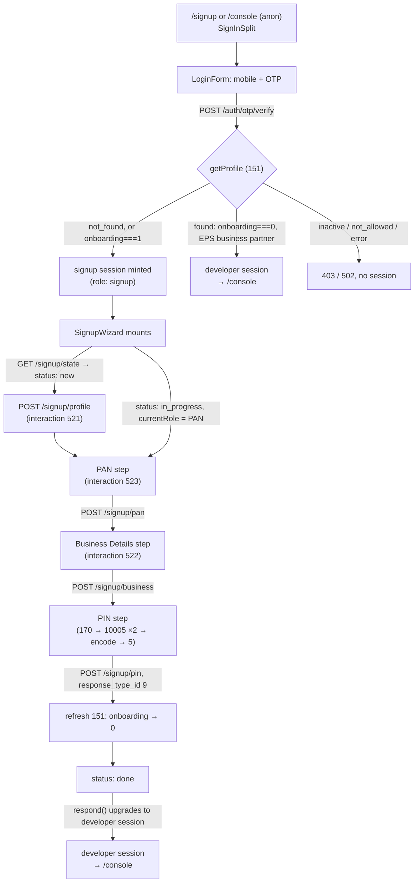

# User Onboarding (Self-Serve Signup)

`/signup` lets a new mobile number create an EPS account without going through
the Eloka webapp: OTP → partial account → PAN → Business Details → PIN →
`/console`. It replaces
the old `/signup` page, which was a Zoho lead-capture iframe
(`src/pages/SignupPage.tsx` is now the wizard host, not that iframe).

Design rationale: `docs/superpowers/specs/2026-07-15-user-onboarding-design.md`.
This document describes the code as built; where the two disagree, this
document wins and the disagreement is called out explicitly.

## Journey


```mermaid
flowchart TD
    A["/signup or /console (anon)\nSignInSplit"] --> B["LoginForm: mobile + OTP"]
    B -->|"POST /auth/otp/verify"| C{"getProfile (151)"}
    C -->|"not_found, or onboarding===1"| D["signup session minted\n(role: signup)"]
    C -->|"found: onboarding===0, EPS business partner"| Z["developer session\n→ /console"]
    C -->|inactive / not_allowed / error| X["403 / 502, no session"]

    D --> E["SignupWizard mounts"]
    E -->|"GET /signup/state → status: new"| F["POST /signup/profile\n(interaction 521)"]
    F --> G
    E -->|"status: in_progress, currentRole = PAN"| G["PAN step\n(interaction 523)"]
    G -->|"POST /signup/pan"| G2["Business Details step\n(interaction 522)"]
    G2 -->|"POST /signup/business"| H["PIN step\n(170 → 10005 ×2 → encode → 5)"]
    H -->|"POST /signup/pin, response_type_id 9"| I["refresh 151: onboarding → 0"]
    I --> J["status: done"]
    J -->|"respond() upgrades to developer session"| K["developer session\n→ /console"]
```

Every step re-fetches the upstream profile (interaction 151) and returns
fresh `SignupState`; the client never infers its own progress. This is what
makes resume-after-drop-off and retry-after-failure the same code path
(`packages/eps-backend/src/signup/service.ts:114-117`, `refresh()`).

## Which backend authenticates the OTP

The OTP exchange has two possible answerers, selected at startup by whether
`CONNECT_API_BASE_URL` is set (`packages/eps-backend/src/buildApp.ts`):

- **unset (default)** — `eps-backend` calls SimpliBank interactions 515 → 518 →
  151 itself. This is the path described everywhere below.
- **set** — login is delegated to Eloka's `connect-api`
  (`POST /authentication/sendotp` + `/login`), so the EPS portal and Eloka share
  one identity and one upstream session. `connect-api`'s own token pair is
  sealed in KV at `ca:<sid>` and never reaches the browser.

Either way the browser sees only this service's `eps_at` / `eps_rt` HttpOnly
cookies, and the classification table below is unchanged — `mapConnectLogin`
(`packages/eps-backend/src/clients/connect.ts`) maps `connect-api`'s login
envelope onto the same `ProfileResult` union `getProfile` returns, in the same
branch order. See "Auth providers" in `packages/eps-backend/README.md`.

Only the _OTP exchange_ is delegated. Every onboarding interaction below (521,
523, 522, 170, 10005, 5) still goes straight to SimpliBank with the
`developer_key` header under both providers, and so does the `/signup/state`
profile refresh.

**The profile is read from 151 under both providers, login included.**
`mapConnectLogin` classifies the envelope — that is what decides whether a
session is minted at all — but for a `found` result `connectProvider.enrich`
then replaces the profile with a real `eko.getProfile` read. Without it the two
views of one account disagreed: connect-api's `auth_details` is a profile it
assembles field by field, so anything it does not name is simply absent, and
`account_state_id` is not named. A login therefore reported `accountStateId:
null` → `active` for an account whose KYC was outstanding, and the next `/me`
silently corrected it — the bug reads as "the badge is wrong until I reload".

The re-read may only add fields, never change the verdict: a 151 that fails or
returns some other kind leaves the envelope's profile untouched, because the OTP
has already been consumed and a transient upstream blip must not turn a good
login into a refusal.

## Why there is no Eko access token

`/transactions/do` and `/transactions/upload`, which the Eloka webapp calls,
are **not Eko endpoints** — they are routes on Eloka's own BFF (`connect-api`),
which forwards to the same form-encoded SimpliBank path `eps-backend` already
calls. The `Bearer` token Eloka sends never goes upstream; `connect-api` uses
it only to derive `initiator_id` / `user_code` / `org_id` for the outbound
call, falling back to a configured default pair when they're absent (exactly
the signup case, before a real user identity exists).

`eps-backend` is the equivalent layer and does this today, in
`packages/eps-backend/src/clients/eko.ts:168-183`:

```ts
function base(orgId?: number): Record<string, string> {
	return {
		initiator_id: cfg.initiatorId,
		user_code: cfg.userCode,
		org_id: String(orgId ?? cfg.defaultOrgId),
	};
}

function actor(identity: EkoIdentity): Record<string, string> {
	return {
		initiator_id: identity.initiatorId,
		user_code: identity.userCode,
		org_id: String(identity.orgId),
	};
}
```

`base()` supplies the configured `EKO_INITIATOR_ID` / `EKO_USER_CODE` pair
(`packages/eps-backend/src/config.ts:100-101`) before a partial account
exists (used by `createPartialAccount`, interaction 521). `actor()` supplies
the user's own **mobile** / `code`, mapped from the 151 response by
`identityOf()`, for every step after the account exists (523, 170, 10005, 5).

`initiator_id` is the user's **registered mobile number** — never an internal
id. This mirrors connect-api, the live Eloka backend: its 151 login builds the
JWT claim with `user_id: detail.mobile` (`routes/authentication.js`), and every
later interaction sends `initiator_id = tokenDetails.user_id`, i.e. the mobile
(`routes/transactions.js`). The `eko_user_id` rides in that claim but is never
sent as `initiator_id` anywhere; the public spec agrees (`initiator_id` —
"Registered mobile number of the API user", `api-specs-common.ts`). Sending
`ekoUserId` here earns a 403 whose message reads "Invalid Sender/Initiator" —
the same misleading text interaction 151 uses for MERCHANT_NOT_FOUND.

Before the partial account exists, connect-api sends no user identity at all —
it falls back to the DEFAULT pair (`DEFAULT_TRXN_INITIATOR_ID` `1234567891` /
`DEFAULT_TRXN_USER_CODE` `99029899`, matching our config defaults) plus
`user_identity` / `user_identity_type`, which is exactly what `base()` +
`createPartialAccount` do.

Every upstream call authenticates with the `developer_key` header alone
(`eko.ts:120`, `post()`). No Eko access token is captured, stored, or
refreshed anywhere in this feature — the existing HttpOnly session cookie is
the only credential the browser holds.

## The `onboarding === 1` gate

`getProfile` in `packages/eps-backend/src/clients/eko.ts:234-290` classifies
the upstream 151 response into a `ProfileResult`. The onboarding check
(`eko.ts:262-275`) runs **before** the EPS-business-partner check
(`eko.ts:276-279`):

```ts
if (code === SUCCESS_CODE && d) {
	// Onboarding-in-progress is checked FIRST and deliberately: user_type
	// flips to "23" as soon as the partial account exists, so it cannot
	// tell an in-progress user from a finished one. `onboarding === 1` is
	// the only reliable signal. Gating on user_type first would classify
	// every mid-onboarding user as not_allowed and lock them out on every
	// subsequent login.
	if (Number(d.onboarding ?? 0) === 1) {
		return { kind: "onboarding", responseTypeId: code, profile: mapProfile(d) };
	}
	if (Number(d.org_id ?? 0) !== 1 || String(d.user_type ?? "") !== "23") {
		return { kind: "not_allowed", responseTypeId: code };
	}
	return { kind: "found", responseTypeId: code, profile: mapProfile(d) };
}
```

`user_type` becomes `"23"` the moment `createPartialAccount` (521) succeeds —
long before onboarding is actually complete. If the `user_type` check ran
first, every user who created a partial account but hasn't finished PAN/PIN
would fail the business-partner check on their next login and be classified
`not_allowed` (a hard 403), permanently locking them out of resuming. Checking
`onboarding === 1` first is the only ordering that lets a mid-onboarding user
keep resuming.

`ProfileResult` (`packages/eps-backend/src/types.ts:24-42`) carries this as
its own `onboarding` variant, distinct from `found`. A unit test in
`clients/eko.test.ts` (`"getProfile onboarding classification"`) asserts the
ordering directly: a profile with `user_type: "23"` **and** `onboarding: 1`
still returns `kind: "onboarding"`, not `found`.

The verify-OTP handler (`packages/eps-backend/src/http/app.ts:182-282`) acts
on this:

| `getProfile` result | Response                                               |
| ------------------- | ------------------------------------------------------ |
| `not_found`         | signup session (no steps done yet)                     |
| `onboarding`        | signup session (resume — see below)                    |
| `found`             | developer session (unchanged from before this feature) |
| `inactive`          | 403 `ACCOUNT_INACTIVE`                                 |
| `not_allowed`       | 403 `NOT_ALLOWED`                                      |
| `error`             | 502 `PROFILE_UNAVAILABLE`                              |

### Lifecycle state (`MeView.state`)

`deriveStateFromProfile` (`packages/eps-backend/src/identity/me.ts`) turns that
`ProfileResult` into the string the console renders as
`useAuth().state.me.state`. The frontend never computes it — it only checks the
value against `LIFECYCLES` (`src/lib/auth/client.ts`) and fails closed to `anon`
on anything unrecognised.

| `ProfileResult`                                  | `MeView.state` |
| ------------------------------------------------ | -------------- |
| `inactive`                                       | `inactive`     |
| `error` / `not_allowed`                          | `unknown`      |
| `not_found` (+ Zoho lead lookup, else `unknown`) | `lead`         |
| `onboarding`                                     | `onboarded`    |
| `found`, `onboarding === 1`                      | `onboarded`    |
| `found`, `account_state_id === 48`               | `kyc-pending`  |
| `found`, anything else (16, unmapped, absent)    | `active`       |

Two properties of that last pair are deliberate:

- **`onboarding` is tested for `1`, not "not 0".** A third value appearing
  upstream is not a reason to tell a finished partner their onboarding is
  unfinished.
- **The account-state branch fails OPEN.** Only 48 is pending; 16, an id this
  build has not mapped, and `null` all read as `active`. The connect-api provider
  never reports an id at all (its `auth_details` has no such field), so reading an
  unknown id as pending would have put a blocking KYC step in front of every
  partner on that provider. `toStateId` rejects blanks rather than coercing them,
  because `Number("")` is `0` and a blank field must not become a real-looking id.

### What `/me` forwards about the user

`EkoProfile` carries the typed fields the console has always read, plus two
additions:

- `accountStateId` — the id above, typed because the state machine branches on it.
- `userDetail` — upstream's **whole** `user_detail`, filtered by a denylist
  (`clients/profile-fields.ts`), so the console can read the long tail of profile
  fields (PAN, current plan, alternate mobiles, profile picture,
  primary-mobile metadata) without a backend release per field.

That is a **denylist**, unlike the `detailBlocks` block-name allowlist beside it,
and the trade is explicit: everything in it reaches browser JavaScript and
`sessionStorage`, so it is PII sitting where an injected script could read it,
and the filter cannot know about a credential upstream adds under a new name.
`stripSensitive` recurses into nested objects and arrays, drops keys matching
`token|secret|password|passwd|otp|_key$|^key$|^[mtu]?pin$`, and deliberately
keeps `pincode`/`pin_code` (postal codes) and `is_pin_not_set` (a flag, not a
PIN). Widen it the moment 151 grows a credential-shaped field.

The whole `MeView` is parked in `sessionStorage` by `session-cache.ts` so a
reload paints the signed-in shell immediately. Its envelope `VERSION` is bumped
whenever this shape changes — currently **2** — so a blob written by an older
build is discarded rather than rendered half-populated.

**`DEV_ALLOW_ANY_USER_TYPE=true` (DEV/UAT only)** skips the business-partner
gate in both classifiers (`clients/eko.ts`, `clients/connect.ts`), org check
included, so any authenticated Eloka user — retailer, distributor, agent — gets
a developer session instead of `not_allowed`. It exists so the console can be
tested with existing test mobiles. The `onboarding` and `inactive` branches are
untouched; the flag only removes the `not_allowed` outcome. Must stay `false` in
production — it opens the developer portal to the whole Eloka user base.

The old `403 NOT_REGISTERED` branch (behind a `TODO(signup)`) is gone —
`not_found` and `onboarding` are combined into one branch at
`app.ts:238-257`. The error code no longer exists anywhere in the codebase.

## Session roles

`SessionClaim.role` (`packages/eps-backend/src/auth/session.ts:14`) gains a
third value:

```ts
role: "developer" | "admin" | "signup";
```

A `signup` session authorizes `/signup/*` only — `requireSignupSession` in
`packages/eps-backend/src/http/signup.ts:27-39` rejects any other role with
`403 NOT_SIGNUP_SESSION`, and `/admin/*` never accepts it. The claim carries
`sub` (the mobile) exactly like a developer session; cookies, TTLs, and
refresh rotation (`session.ts:99-124`) are unmodified.

`GET /me` (`app.ts:331-357`) special-cases this role **before** it would
otherwise call the Eko API:

```ts
if (claim.role === "signup") {
	const view: SignupView = { role: "signup", mobile: claim.sub };
	return c.json(view);
}
```

This mirrors how the pre-existing admin branch (`app.ts:337-343`) avoids an
Eko/Zoho call. `AuthProvider` boots exclusively from `/me`
(`src/lib/auth/AuthProvider.tsx:50-56`, `refresh()`), so if `/me` rejected or
special-cased away a signup session, reloading the page mid-onboarding would
drop the user to `anon` and force a brand-new OTP — defeating resume. Instead
`SignupView` is a fixed, two-field shape (`role`, `mobile`) with no upstream
call, so the reload is cheap and instant; the actual onboarding progress is
fetched separately by `SignupWizard` from `GET /signup/state`, which _does_
hit the Eko profile.

**On a fresh login, `AuthProvider` does not call `/me` at all.**
`POST /auth/otp/verify` already answers with the exact view `/me` would build —
same `buildMeView`, same upstream interaction-151 lookup — so `LoginForm` hands
that response to `adopt()` instead of calling `refresh()`. Doing otherwise spent
a second round-trip, and a second upstream profile call, re-learning what was
already in hand, on the one path where the user is watching a spinner.
`refresh()` remains for `SignupWizard`, which genuinely needs a re-read after
onboarding changes the profile.

`LoginForm` also takes an optional **`prefetch`** callback, fired once when the
OTP step appears. The console passes
`() => import("@/pages/console/ConsoleHome")`, so the dashboard's lazy chunk
downloads during the seconds the user spends reading the SMS instead of adding a
round-trip after the session lands. The caller supplies it rather than the form
naming a page: the two call sites go to different places (`/console` → the
dashboard, `/signup` → the wizard, which is not wired up yet and could be). A
prefetch that rejects is swallowed — the real `import()` retries on render, and a
cold cache must never fail a login.

`LoginForm` also takes an optional **`submitLabel`** for the mobile-step button,
defaulting to `"Send OTP"`. `SignInSplit` passes `"Send OTP to my mobile"`,
because there the button is the page's only call to action rather than one
control on a card.

Finally, an optional **`mobileStepFooter`** node renders under that button —
inside the `step === "mobile"` branch, so it goes away when the OTP boxes take
over. `SignInSplit` passes its two audience cards through it (see below); the
form itself holds no copy, and `/signup`-style callers that omit the prop render
exactly as before.

### Link parameters: `?mobile=` and `?next=`

Both entry points (`/console` and `/signup`) read two query params, so a
campaign or hand-off link can drop someone straight where they belong.

**`?mobile=`** pre-fills the OTP form. Handled in `LoginForm`'s mount effect,
because both pages reach the field through it and `SignInSplit` holds no state.
The value is stripped to digits and cut to the **last 10**
(`raw.replace(/\D/g, "").slice(-10)`), the same rule `Input`'s paste handler
uses, so `+91 (999) 000-0001` and `09990000001` both land as `9990000001`; a
value that isn't 10 digits after that is ignored. It wins over the remembered
`eko-last-mobile` number — a link that carries a number was aimed at this
visitor — but still uses `setMobile((cur) => cur || …)`, so a fast typist is
never clobbered. Read after mount, like every other URL/storage read on the
prerendered `/signup`.

**`?next=`** is a post-login destination, parsed by `readNextParam()` in
`src/lib/auth/next-param.ts`. It accepts rooted in-app paths only: `//evil.com`,
`/\evil.com` and absolute URLs are rejected, because a redirect target taken
from a URL is an open redirect otherwise. It is applied in two places, both of
which are the moment the console would otherwise render:

- `ConsoleLayout` — as soon as a **developer** session exists, whether from a
  fresh login or an already-signed-in visitor opening the link. The `replace`
  drops `next` from the URL, so the effect no-ops on re-run.
- `SignupPage` — on its existing `role !== "signup"` redirect, i.e. after the
  wizard finishes and the backend swaps in a developer session. Developer only:
  an admin has no console pages to deep-link into, so it still goes to
  `/console`.

Never mid-onboarding. The wizard never navigates, so `/signup?next=…` keeps the
param the whole way through; and `ConsoleLayout`'s signup bounce carries the
query string (`navigate({ pathname: "/signup", search }, …)`) so a
`/console?next=…` link hit by a half-onboarded session doesn't lose it either.

### The anonymous entry screen

`src/components/auth/SignInSplit.tsx` is what an anonymous visitor sees at
**both** `/console` and `/signup`: a full-bleed two-tone split pairing a
five-step onboarding pitch (signup → try APIs → build → KYC → dashboard) with
the mobile-OTP form. It holds no auth logic — `ConsoleLayout` and `SignupPage`
still own their auth branches and forward `onSuccess` / `prefetch` straight
through to `LoginForm`.

Two consequences worth knowing before editing either page:

- The split needs the full width, so it renders **outside** the
  `container mx-auto` wrapper the other logged-out states share. In
  `ConsoleLayout` the anon branch is therefore its own `<main>`, and the
  "Developer Console" `h1` that wraps the loading/admin cards is not in it —
  the split's hero is that page's only `h1`.
- It also renders outside those states' `pt-24 lg:pt-28`. The site header is
  `position: fixed` and 88px tall; clearing it with padding on `<main>` would
  strand a strip of page background above the split. Instead the section starts
  at `y=0` and the two columns that touch the top edge carry `--header-h`
  (5.5rem) in their own top padding, so each paints its own background behind
  the header. Change that variable, not the page, if the header ever resizes.
- Mobile OTP is the only method offered. The source design also drew "Continue
  with Google" / "Continue with GitHub"; there is no OAuth backend, so those are
  deliberately absent and `SignInSplit.test.tsx` guards against them coming
  back by accident.
- **One door, two audiences.** The same number + OTP both logs in a returning
  developer and starts a new signup, but the widget used to be headed "Create
  your developer account", so returning users assumed they were on the wrong
  screen. The heading is now "Log in or sign up", and two cards under the submit
  button — "Have an account?" / "First time?" — say what happens either way.
  They ride in on `LoginForm`'s `mobileStepFooter`, so they vanish at the OTP
  step, where the question is already settled. The footnote that used to carry
  this ("Already have an account? The same flow logs you in.", tacked onto the
  legal line) is gone.

`AuthProvider.classify()` (`src/lib/auth/AuthProvider.tsx:34-44`) maps this
onto a typed `AuthState` variant, `{ status: "authed"; role: "signup"; me:
SignupView }`, which `SignupPage.tsx` switches on directly.

### Signup-to-developer session upgrade

When a signup session reaches `status: "done"` (onboarding completed, PIN
set successfully), every signup route funnels its response through a `respond()`
helper (`packages/eps-backend/src/http/signup.ts:81-110`) that upgrades the
session to a real developer session before returning the response.

The upgrade flow (`signup.ts`, inside `respond()`):

1. Re-fetch the upstream profile via `eko.getProfile()`.
2. Only mint on `profile.kind === "found"` — every other kind returns the
   `done` state unmodified, no cookie set. `buildMeView` never throws for
   `inactive` / `not_allowed` / `error` (it resolves them to a neutral or
   inactive `MeView` instead), so gating on its _output_ would silently mint a
   developer session for exactly the profiles `POST /auth/otp/verify` refuses
   outright (403 `ACCOUNT_INACTIVE` / 403 `NOT_ALLOWED` / 502
   `PROFILE_UNAVAILABLE`). The realistic trigger is a transient upstream flake
   (`error`) landing between "onboarding succeeded" and this re-fetch. Gating
   on `profile.kind` directly closes that gap.
3. Build the normal `MeView` from the `found` profile, mirroring the
   `POST /auth/otp/verify` "found" branch exactly.
4. Mint a developer claim with `role: "developer"`, `orgId` taken directly
   from the `found` profile (never `cfg.eko.defaultOrgId` — a `found` profile
   always carries a real `orgId`), the same `sub` (mobile), **and the signup
   claim's `sid`** (see below).
5. Mint fresh access and refresh tokens and set them as cookies.
6. Ask the auth provider to rotate the upstream session
   (`auth.refreshEntitlements(sid)`), so the token stops speaking for the roles
   the user had at login.

All five routes (`/signup/state`, `/signup/profile`, `/signup/pan`,
`/signup/business`, `/signup/pin`) funnel responses through `respond()`. The inclusion of
`/signup/state` is deliberate: if a user finished onboarding but still holds
a stale signup cookie (e.g., after a page reload mid-navigation), their next
`/signup/state` call retries the upgrade rather than requiring only PIN
completion to trigger it (line 112-119).

If the upgrade's profile re-fetch throws (network, upstream error), the
request still returns `done` state and succeeds — onboarding succeeded
upstream, and the upgrade is automatically retried on the next
`/signup/state` call (ponytail comment on the `catch`). The non-`found`-kind
guard above and this `catch` cover two different failure shapes: the guard
handles a re-fetch that _resolves_ to something other than `found`; the
`catch` handles a re-fetch that throws outright. Either way, a failed or
inconclusive upgrade never rolls back onboarding completion, and never mints
a session on unverified data.

Once the cookies are set, the frontend's next `/me` call arrives with a
developer role, `AuthProvider` re-classifies it to `{ status: "authed";
role: "developer" }`, and `SignupPage`'s redirect condition
(`state.role !== "signup"`) fires, routing to `/console`.

#### Why the upgrade carries the `sid`, and rotates upstream

Under the `connect` provider, `POST /auth/otp/verify` mints a `sid` and seals
connect-api's tokens in KV at `ca:<sid>`. The upgraded claim **must** carry that
same `sid` across: every Connect-backed route fails closed on a missing one
(`/connect/*` → 501 `CONNECT_UNAVAILABLE`, likewise `/dashboard` and
`/notifications`). A sid-less upgrade orphans the sealed session, and the console
loses everything gated on the interaction list — Upload Documents, Load Wallet,
Sign Agreement, Manage My Account — with no way to recover short of signing out
and back in, since the replacement cookie is what a reload replays.

The sealed token itself is also stale by construction: it was minted while this
user was still mid-onboarding, so the roles baked into it predate the account
they now have. `auth.refreshEntitlements(sid)` exchanges it through
`POST /authentication/token` so `/transactions/wlc` reports the new
entitlements. It is deliberately weaker than `refresh`:

- It ignores the token's remaining lifetime — age is not the question being asked.
- Its failure is logged, not fatal, and only **after** the cookies are set. Stale
  entitlements are recoverable; an upgrade that never happens strands the wizard
  on its final card forever, because the client only re-checks `/me` when the
  signup status changes and it cannot change again.
- It skips a session rotated within the last minute
  (`ENTITLEMENT_ROTATE_MIN_INTERVAL_MS` in `connectProvider.ts`). connect-api's
  refresh token is single-use, and every completed `/signup/*` response asks for
  a rotation, so a repeated or double-submitted request would otherwise race two
  rotations against one stored session.

Under the direct `eko` provider there is no upstream session, so claims have no
`sid` and nothing is rotated.

#### Troubleshooting stale entitlements after signup

Symptom: onboarding completes, the console loads, but the entitlement-gated
nav (Upload Documents, Load Wallet, Sign Agreement, Manage My Account) is
missing — and stays missing across reloads, while a fresh login in another
browser shows it. The diagnostic logs below are **always on** (no
`EKO_LOG_LEVEL` needed) precisely because this failure was silent twice.

A completed signup emits this backend sequence (grep prod with
`./deploy/health.sh logs 500 | grep -E '\[signup\]|\[connect'`, dev with
`npm run dev:pretty`):

| Log line | Emitted by | What it tells you |
| --- | --- | --- |
| `[connect-auth] login { profileKind, userType, anonymousUser }` | OTP verify | The identity connect-api minted at login. A brand-new signup correctly says `anonymousUser: true` here. |
| `[signup] upgrade { sid, profileKind }` | every `done` `/signup/*` response | The upgrade ran; `profileKind !== "found"` means it bailed before minting. |
| `[signup] entitlement refresh requested` / `failed` / `unavailable` | same | Whether the rotation was even asked for. |
| `[connect-auth] entitlement refresh collapsed { rotatedAgoMs }` | provider | The 60s guard swallowed it — the upgrade rode an *earlier* rotation, from before the roles changed. |
| `[connect-auth] rotated { sid, userType, anonymousUser }` | provider | **The H1 test.** The identity on the token `POST /authentication/token` handed back. |
| `[connect] wlc { sid, count, kycEntitled }` | `/connect/interactions` | What upstream actually served for this sealed token (586+587 = Upload Documents). |

Browser side, the same request logs `[connect] interaction list fetched
{ count, kycEntitled }` (`console.debug` — enable Verbose in devtools) and a
`console.warn` when the fetch failed, which the UI otherwise renders
indistinguishably from "not entitled".

Verdict table for a repro:

- `[connect-auth] rotated` fires after the upgrade but still shows
  `anonymousUser: true` (or `wlc` stays `kycEntitled: false` right after a
  successful rotation) → **`POST /authentication/token` cannot rebind the
  pre-onboarding session to the new partner user.** Rotating harder will not
  fix it; the session must be re-minted via a fresh login (or an upstream
  session-upgrade API — connect-api owner question). `userType: "<absent>"`
  means the token endpoint sent no details block and the `wlc` line is the
  only evidence.
- `entitlement refresh collapsed` / `failed` / `unavailable` at the moment of
  completion → the one-shot rotation was skipped; the stored token is the
  login-time one until it nears expiry hours later.
- Backend `wlc` says `kycEntitled: true` but the menu is missing → frontend.
  The signup→developer upgrade resets the tab's module caches synchronously in
  `AuthProvider.accept()` (interaction list, widget tokens, dashboard,
  balance), and `useKycEnabled` re-fetches when the role changes — check the
  `[connect] signup→developer upgrade` debug line fired.

Local repro: fresh mobile on UAT → complete the wizard → watch the sequence
above in order. The whole point of the ordering is that `login`,
`rotated`, and `wlc` each carry the identity/entitlement snapshot at their
step, so the first line where the new roles *should* appear and don't names
the failing layer.

## Interaction reference table

All eight onboarding interactions post to the same `cfg.eko` SimpliBank path
with the `developer_key` header. Seven of the eight (521, 522, 170, 10005, 5,
287, 293) go through the shared `post()` helper, form-urlencoded; 523 goes through the
sibling `postMultipart()` helper instead — see "PAN (523)" above. Both
helpers share one send/log/error pipeline (`sendForm()` in `eko.ts`), so
logging and error semantics are identical either way. Success is judged
per-interaction — there is no single convention:

| #     | Interaction             | Method (`eko.ts`)                              | Identity used                 | Success condition                                                                                                                                                                          |
| ----- | ----------------------- | ---------------------------------------------- | ----------------------------- | ------------------------------------------------------------------------------------------------------------------------------------------------------------------------------------------ |
| 521   | Create partial account  | `createPartialAccount`                         | configured default (`base()`) | `response_type_id === 1566` (`CREATE_PARTIAL_ACCOUNT_OK`)                                                                                                                                  |
| 523   | Verify PAN              | `verifyPan` (multipart, via `postMultipart()`) | user's own (`actor()`)        | `response_type_id === 1569` (`PAN_VERIFICATION_OK`)                                                                                                                                        |
| 522   | Business details        | `submitBusiness` (398-414)                     | user's own (`actor()`)        | `response_type_id === 1567` (`BUSINESS_DETAILS_OK`)                                                                                                                                        |
| 170   | Get booklet number      | `getBooklet` (326-351)                         | user's own                    | **both** `response_status_id === 0` **and** `response_type_id === 1646` (`BOOKLET_OK`) — the code comments that this interaction reports success on both ids and neither alone is accepted |
| 10005 | Fetch pintwin key       | `fetchPintwinKey` (352-365)                    | user's own                    | no status code check — accepted iff the response carries both a non-empty `pintwin_key` and a `key_id`                                                                                     |
| 5     | Set secret PIN          | `setSecretPin` (366-382)                       | user's own                    | `response_type_id === 9` (`SECRET_PIN_OK`)                                                                                                                                                 |
| 287   | Fetch e-sign URL        | `getAgreementUrl`                              | user's own                    | `status === 0` **and** a `data.short_url` with an `http(s)` scheme — **not** a fixed `response_type_id` (see below). `response_type_id` 1615/1069 with `status` 0 means already signed     |
| 293   | Submit signed agreement | `submitSignAgreement`                          | user's own                    | `status === 0`. An absent `status` fails, unlike 287                                                                                                                                       |

`stepResult()` (`eko.ts`) is the shared classifier for 521/523/522/5,
comparing `response_type_id` against the interaction's own success constant
and otherwise surfacing the upstream `message` as `EkoStepResult`.

**287/293 are the exception: they classify on `status`, not on an id.** The
documented esign ids were stale — a live 287 success answers `response_type_id:
1043` with the message `"Document Id From Digio"`, and 293 has answered both
1043 and 1069. Error replies put the error id in `status` (1083 "Invalid
agreement id.", 1070 "Document not verified successfully"), so `status === 0`
discriminates where an id allowlist did not. 293 also requires an
`agreement_status` field (upstream parameter 638, context `[API Self
Onboarding]`); omitting it answers `invalid_params: {agreement_status: …}`.
The BFF sends `"success"` — it is only ever called once the signing provider
reported success.

**`agreement_id` is per-user, read from the profile.** Both interactions send
`user_detail.agreement_id` off the caller's own interaction-151 profile, via
`agreementIdOf()` (`eko.ts`). It was hardcoded to `"4"` — the API (EPS) partner
agreement — until it was noticed upstream carries the right one per user. There
is deliberately **no fallback**: when the profile has no usable id, the signup
service throws `SignupStepError` before any upstream call, because a guessed id
either fails as 1083 "Invalid agreement id." or signs the wrong agreement. The
id is re-read from the profile on 293 rather than carried over from 287 —
upstream treats it as a property of the user, so the two reads agree; if that
stops holding, bind the id to the `document_id` in KV at 287 instead.

287 returns the `document_id` under `data` when it issues a
URL but at the **top level** on the already-signed replies; reading only `data`
yields `""`, which then rides into 293 as an empty `document_id`. Its `esign_completed` / `completion_timestamp` fields have no
upstream parameter definition at all and are kept purely for Eloka parity.

On failure, every step forwards upstream's `invalid_params` /
`dependent_params` / `list_items` to the client as `error.details` on the 400
(`EkoStepResult.details` → `SignupStepError.details` → `AppError.details` →
`errorBody`). Upstream's `message` is often a template that names no field, so
without them a validation failure is undiagnosable from the browser.

523 is the one onboarding interaction sent as `multipart/form-data` instead of
plain urlencoded: the reference `connect-api` implementation wraps its 523
call in a single multipart part, literally named `form-data`, whose value is
the same URL-encoded field string every other interaction sends as its body
directly — plus the `client_ref_id` the transport adds to every interaction. No file part is included (`eko.ts` `verifyPan`; confirmed by
`clients/eko.test.ts`, `"verifyPan sends 523 as multipart with one
'form-data' part and no file"`). The design's original "no file part"
question is settled: it is genuinely not sent. **This multipart contract is
unverified against the real upstream — a UAT gate**, same caveat as the
`latlong` constant below.

Eko's _documented_ file-upload APIs now put a **JSON object** in that same
`form-data` part (`MULTIPART_JSON_FIELD` in `src/lib/data/api-specs-common.ts`,
which the published SDKs and `/docs` samples follow). 523 still sends the
URL-encoded string above and is deliberately left alone: it carries no files, and
flipping it unverified would break PAN verification for every new signup. Settle
it with the same UAT question.

## Pintwin (170 → 10005 → 5)

Pintwin is **digit substitution, not encryption**. The 10005 response hands
back a 10-character permutation of `0`-`9` in plaintext
(`packages/eps-backend/src/signup/pintwin.ts:1-41`):

```ts
export function encodePin(
	pin: string,
	key: string,
	keyId: number | string,
): string {
	// out[i] = key[pin[i]], then "encoded|keyId"
}
```

`out[i] = key[Number(pin[i])]`, joined and suffixed with `"|" + keyId`. Golden
vectors from Eloka's own tests, asserted in `signup/pintwin.test.ts`:
`encodePin("1234", "1974856302", 39) === "9748|39"` and
`encodePin("0123", "0123456789", 55) === "0123|55"`.

Because the key ships in the clear, obfuscation is the only property this
buys on its own. The real security property is that **each key is single-use
and invalidated upstream per attempt**, so a captured `okekey` cannot be
replayed. `signup/service.ts:145-186` (`submitPin`) fetches one fresh key per
PIN — two independent calls to `fetchPintwinKey`, mirroring Eloka's two
independent Pintwin mounts — so a failed attempt simply re-keys on retry;
there is no refresh-signalling logic anywhere.

Encoding runs entirely in the BFF (`signup/service.ts:176-177`, the two
`encodePin(...)` calls feeding `eko.setSecretPin`). The client
(`src/features/signup/PinStep.tsx`) sends the two raw 4-digit PINs over
HTTPS to `POST /signup/pin` and holds no key state at all — no fetch, no
hook, no loader tied to the pintwin lifecycle. `service.ts:146-153` validates
`pin1 === pin2` and the 4-digit format **before** touching upstream, so a
client-side mismatch never burns a single-use key.

## How to add a step

The step order and labels are never hardcoded on either side — they come
from the API's `onboarding_steps` at runtime. Adding a step is two additions,
no branching logic anywhere else:

**Backend** (`packages/eps-backend/src/`):

1. Add an interaction method to `clients/eko.ts` (follow the `verifyPan` /
   `setSecretPin` pattern: build the form fields, call `post()`, classify the
   result).
2. Add an orchestration method to `signup/service.ts` that calls it and
   returns `refresh(mobile, xRealIp)` so the client gets fresh state.
3. Add a route to `http/signup.ts` that validates input, calls the service
   method, and maps `SignupStepError` via `toAppError`.

**Frontend** (`src/features/signup/`):

1. Write the step component to the `StepProps` contract
   (`resolveSteps.ts:5-16`): `onSubmit(values: Record<string, string>) =>
Promise<void>`, `busy`, `error`. Values are a **named record keyed by field
   name**, not a positional array — each step picks its own keys out of the
   record in its `submit` closure below. For a multi-field step,
   `businessFields.ts` is the pattern to copy: declare every field once (name,
   label, kind, validation) in one array, then derive both the rendered form
   and client-side validation from it, so adding a field is a one-line change
   instead of touching the component in three places.
2. Add **one** entry to `SIGNUP_STEPS` in `steps.ts`, with the role code and a
   `submit` closure:

```ts
{ role: 13000, name: "pan", label: "PAN Details", Component: PanStep,
  submit: (client, v) => client.submitPan(v.pan) },
```

That is the entire registry surface. `resolveSteps()` (`resolveSteps.ts:83-122`)
filters the registry down to whatever roles the API actually returned, orders
them by the API's order (not the registry's), prefers the API's label,
falling back to the registry's, and marks steps before `currentRole`
complete. **The wizard never branches on step names** — `SignupWizard.tsx`
picks whichever `ResolvedStep` has `status === "current"` and renders its
`Component`, forwarding `onSubmit` straight into that step's own `submit`
closure. A role in the API the registry doesn't know is silently skipped
rather than thrown on, so the backend can ship a new step before the frontend
has UI for it.

A new entry also appears in the step rail automatically: `StepRail.tsx` renders
whatever `resolveSteps()` returns, so there is no second list to update. It
must stay that way — never hardcode a step count or order in the rail.

## Progress UI

`StepRail.tsx` draws the whole journey rather than a bare counter: every step's
title is listed, completed steps carry a check, the current one is highlighted,
and pending ones stay muted. It renders beside the form from `lg` up and
collapses to a row of circles plus "Step N of M" below that — one component and
one DOM tree, with the orientation swapped in CSS only, so no second render
branch can drift.

Status comes entirely from `ResolvedStep.status`; the rail holds no state. It
renders only on the current-step path, and returns `null` for an empty step
list rather than claiming "Step 0 of 0".

Because each step's label appears twice (rail plus card heading), tests must
scope to the heading — `getByRole("heading", { name, level: 3 })` — rather than
`getByText`, which now matches both.

Note: the design spec described this differently — "add its submit shape to
the wizard's `onSubmit` switch." That switch does not exist in the built
code; the wizard has zero knowledge of step-specific call signatures. Each
`StepDefinition` owns its own `submit`, which is strictly less coupling than
the spec proposed, and is what's actually shipped.

## Known constants and their caveats

`ONBOARDING_LATLONG = "27.176670,78.008075,7787"`
(`packages/eps-backend/src/clients/eko.ts:61-67`) is sent on every
interaction that wants a `latlong` field (521, 523, 522, 170, 5). This flow
does not port Eloka's geolocation capture step, and Eloka itself falls back to
this exact value when its own capture step is skipped or denied. **Not
confirmed against real UAT** — it may be silently accepted, or the field may
not be required at all for these interactions.

`INDIAN_STATES` (`src/features/signup/businessFields.ts:15-52`), the 36
values the `current_address_state` field offers, came from a live probe of
interaction 387 (the state list) against UAT on 2026-07-16 — upstream's
`value` and `label` are identical, so one array serves both. Unlike the other
constants in this section, this one **is** confirmed against real UAT, and its quirks
are load-bearing, not typos: `"PondiCherry"`'s casing, Delhi spelled out with
a `(UT)` suffix, `"Andhra Pradesh (New)"` sorted last rather than
alphabetically in the source array (the UI re-sorts for display), and no
`"Ladakh"` entry. Do not "fix" any of these — interaction 522 matches on the
exact string.

`alternate_user_id` on 10005 (`fetchPintwinKey`, `eko.ts:357`) is sent as the
user's mobile number. Eloka's own implementation reads a `temp_user_id` from
`sessionStorage` whose provenance is not visible in that codebase — this
design substitutes the mobile as a reasonable guess. **Not confirmed against
real UAT.** If 10005 ever returns no key, this is the first thing to check;
it is a one-line change (`eko.ts:357`).

## Log redaction

`packages/eps-backend/src/audit/ekoLog.ts:74-75` names three fields:

```ts
const REDACTED_REQUEST_FIELDS = new Set(["first_okekey", "second_okekey"]);
const REDACTED_RESPONSE_FIELDS = new Set(["pintwin_key"]);
```

Redaction is applied only in the `full` branch (`ekoLog.ts:137-144`), which is
the only level that logs raw request fields or the full response body at all.
`basic` (the production default) never logs request fields and its
`responseSummary()` allowlist (`ekoLog.ts:50-64`) cannot reach a nested
`pintwin_key`, so there is nothing for these sets to redact at that level —
not because redaction runs there too, but because `basic` never puts the
field in the log line in the first place (`ekoLog.ts:145-150`).

The raw PIN itself never reaches this logger — it never leaves the BFF
unencoded. The actual risk is narrower but real: at `EKO_LOG_LEVEL=full`,
`ekoLog` logs the complete request fields and response body
(`ekoLog.ts:137-144`). `first_okekey` / `second_okekey` are request fields on
interaction 5; `pintwin_key` is a response field nested under `data` on
interaction 10005 (`redactResponse` recurses to reach it,
`ekoLog.ts:93-103`). Redacting only one side is not sufficient: the
substitution is a plain digit map, so an `okekey` **and** the `pintwin_key`
that produced it, logged together, recover the PIN exactly. Redacting both
independently closes this regardless of which log line someone reads first.
Redaction lives inside `ekoLog` itself, not at call sites, so a future
interaction that happens to reuse either field name is covered automatically
at `full` — but does not extend `basic`'s safety, which was already narrower
by construction.

Interaction 522's request fields — company name, authorized signatory name,
both mobile numbers, and the full registered address — are business PII with
no entry in `REDACTED_REQUEST_FIELDS`, so they are logged in the clear at
`EKO_LOG_LEVEL=full`. This is the existing documented stance, not a
regression: `full` is development-only, and 523's PAN is already logged in
the clear there for the same reason.

## Known gaps / follow-ups

- `alternate_user_id` for interaction 10005 sends the mobile number; Eloka
  reads a `temp_user_id` from `sessionStorage` whose origin isn't visible in
  that codebase. Settle which is correct at UAT (see above).
- The hardcoded `latlong` constant is unverified against the real upstream —
  it may be accepted, rejected, or not required at all.
- The 523 multipart envelope (one `form-data` part, URL-encoded value, no
  file — see "PAN (523)" above) is unverified against the real upstream. This
  is a UAT gate: if 523 starts failing where the flat urlencoded version
  worked in earlier manual testing, this is the first thing to check.
- The ten field names `BUSINESS_FIELDS` sends for interaction 522
  (`src/features/signup/businessFields.ts`) are unverified against the real
  upstream — every test in this feature only asserts our own assumptions back
  to us. Driving a real UAT account sitting at role 13300 through a submit is
  the only check that proves them right; a `response_type_id` other than 1567
  with a field-specific message means a key name is wrong, and Eloka's
  `BusinessDetailsStep.tsx:326-337` is the reference for what 522 expects.
- `createSignupService` (`packages/eps-backend/src/signup/service.ts:52-56`)
  accepts a `cfg: Config` parameter but never reads it — `const { eko } =
deps;` discards it immediately, and no other reference to `cfg` exists in
  the file. Dead parameter; harmless but worth removing or wiring to actual
  use next time this file is touched.
